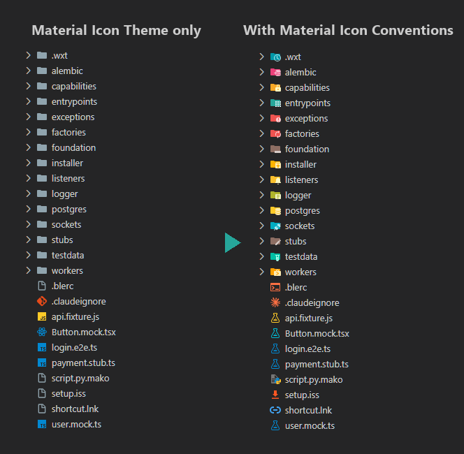

# Material Icon Conventions

[English](README.md)

[Material Icon Theme](https://marketplace.visualstudio.com/items?itemName=PKief.material-icon-theme) がまだ対応していない、よく使われるファイル名・フォルダ名の命名規則にアイコンを割り当てます。アイコンは Material Icon Theme に入っているものと、その色違いだけを使います。

## 機能

- `material-icon-theme.files.associations` と `material-icon-theme.folders.associations` に既定値を提供する
- 合う既存アイコンがないフォルダには、`material-icon-theme.folders.customClones` で色違いの専用アイコンを追加する
- Material Icon Theme のどのアイコンパックでも未対応の名前だけを追加する
- Material Icon Theme 本体の変更、アイコンのコピー、`settings.json` の編集はしない

## 追加する割り当て

### フォルダ

| アイコン | フォルダ名 |
| --- | --- |
| `test` | `testdata`, `test-data`, `test_data` |
| `mock` | `stubs`, `stub`, `fakes`, `fake` |
| `generator` | `factories`, `factory` |
| `api` | `endpoints`, `endpoint`, `openapi`, `swagger` |
| `job` | `workers`, `worker`, `cron`, `crons`, `schedulers`, `scheduler` |
| `event` | `listeners`, `listener`, `subscribers`, `subscriber`, `observers`, `observer`, `emitters` |
| `lib` | `third_party` |
| `mappings` | `mappers`, `mapper`, `serializers`, `transformers` |
| `secure` | `permissions`, `authorization`, `capabilities` |
| `error` | `exceptions`, `exception` |
| `log` | `logger`, `loggers` |
| `connection` | `sockets`, `socket`, `websocket`, `websockets` |
| `database` | `datasets`, `dataset`, `postgres`, `postgresql`, `csv` |
| `migrations` | `alembic` |
| `base` | `foundation` |
| `views` | `popup` |
| `temp` | `.wxt`, `.browser-profile` |

### ファイル

| アイコン | ファイル名・拡張子 |
| --- | --- |
| `test-ts` | `*.mock.ts`, `*.mocks.ts`, `*.fixture.ts`, `*.fixtures.ts`, `*.stub.ts`, `*.fake.ts`, `*.e2e.ts` |
| `test-js` | `*.mock.js`, `*.mocks.js`, `*.mock.mjs`, `*.fixture.js`, `*.fixtures.js`, `*.stub.js`, `*.fake.js`, `*.e2e.js` |
| `test-jsx` | `*.mock.tsx`, `*.mock.jsx`, `*.e2e.tsx` |
| `console` | `.blerc` |
| `claude` | `.claudeignore` |
| `url` | `*.lnk` |
| `installation` | `*.iss` |
| `python-misc` | `*.mako` |

### 色違いの専用アイコン

Material Icon Theme が、既存アイコンの色を変えて生成します。

| 名前 | 元のアイコン | 色 | フォルダ名 |
| --- | --- | --- | --- |
| `installer` | `packages` | `amber-600` | `installer`, `installers` |
| `entrypoints` | `app` | `teal-400` | `entrypoints` |

## 自分の設定が優先される

Material Icon Theme は、割り当ての設定ごとに値を 1 つだけ使います。順番はワークスペースの設定、ユーザーの設定、既定値です。対象の設定は次の 3 つです。

- `material-icon-theme.files.associations`
- `material-icon-theme.folders.associations`
- `material-icon-theme.folders.customClones`

これらを自分で設定している場合はその値が使われ、本拡張機能の割り当ては反映されません。自分でのカスタマイズに干渉しないための、意図した動作です。

## 無効にする

拡張機能ビューで本拡張機能を無効化またはアンインストールします。追加した割り当てだけが外れ、Material Icon Theme はそのまま使えます。

## 動作環境

- Visual Studio Code 1.138 以上
- [Material Icon Theme](https://marketplace.visualstudio.com/items?itemName=PKief.material-icon-theme)（依存関係として自動でインストールされる）。ファイルアイコンのテーマとして選んでおく必要がある

## ライセンス

[MIT](LICENSE)
